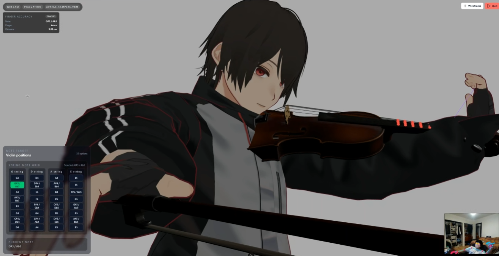

# Violins and VTubers

<p align="center">
  
</p>

## Overview

A browser-based VRM with violin tracking demo built with Nuxt and MediaPipe.

## Method

- Run MediaPipe Holistic in the browser to detect pose, face, and hand landmarks.
- Map detection results onto a Three VRM avatar with live bone updates via forward kinematics.
- Superimpose violin and bow onto the avatar based on detected landmarks.

## Setup

1. Open a terminal and go to the website folder:

```bash
cd Website
```

1. Install dependencies:

```bash
npm install
```

1. Start the development server:

```bash
npm run dev
```

1. Open the localhost:3000 and select:

- a built-in or custom VRM avatar
- webcam or video input
- evaluation mode if using webcam
